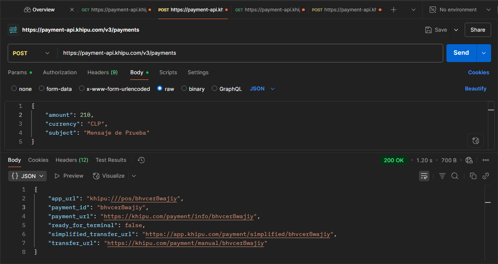
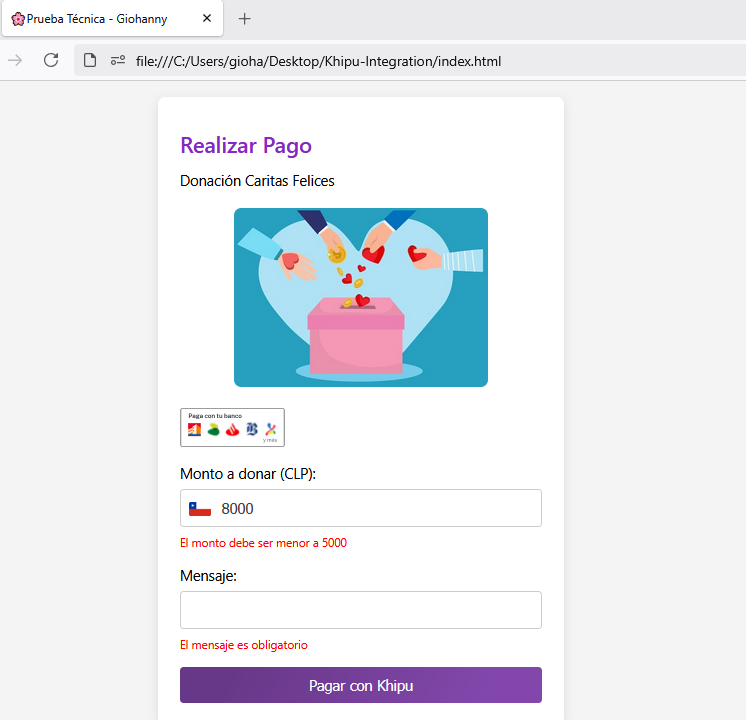

# Khipu Integration 💸

Integración de Khipu usando la [API Khipu Pagos Instantáneos](https://docs.khipu.com/openapi/es/v1/instant-payment/openapi/overview/) en modo desarrollador

## 🔨 Configuración previa
1. Creación de cuenta de desarrollador en Khipu
2. Creación de API Key

<p align="center">
  
</p>
<p align="center"><em>Creación de API Key en la plataforma de Khipu</em></p>

## 🚀 Pasos para la integración
1. Simulación del sitio de compra. Maqueteado en HTML y CSS

2. Creación de pago con [API create payment](https://docs.khipu.com/openapi/es/v1/instant-payment/openapi/operation/postPayment/). Fetch al API con Javascript `https://payment-api.khipu.com/v3/payments`

<p align="center">
  
</p>
<p align="center"><em>Verificación de llamada API en Postman</em></p>


3. Llamado de la url de Khipu para hacer las transacciones. Se encuentra en el parámetro `payment_url`

4. Visualización los cobros en el dashboard en modo desarrollador https://khipu.com/dashboard/bills

## 🎯 Uso de este repositorio

1. Clonar este repositorio
2. Abrir el archivo `index.html` en el navegador
3. Estructura del proyecto:

```
├── index.html          # Maqueteado de tienda virtual
├── fetchAPI.js         # Llamado al API Khipu
├── style.css           # Estilos CSS
├── config.js           # Credenciales del API Key
├── evidenciaImagenes   # Imagenes de apoyo
└── README.md          
```

## 📸 Evidencia de integración exitosa


| :one: Simular tienda virtual  | :two: Validación de campos |
| :-- |:--|
|     |    |
| *Realizar maqueteado de prueba con HTML y CSS* | *Llenar los campos: "Monto" menor a 5000 y "Mensaje" obligatorio* |

| :three: Ingreso de datos  | :four: Modal de espera |
| :-- |:--|
|     |    |
| *Ingresar  los campos correctamente* | *Esperar la respuesta de la API de creación de pago* |


| :five: Seleccionar Banco  | :six: Ingresar con RUT |
| :-- |:--|
|     |    |
| *Para modo desarrollador seleccionar DemoBank* | *Usar RUT ficticio* |


| :seven: Transferencia realizada  | :eight: Pago Verificado por Khipu |
| :-- |:--|
|     |    |
| *Tener en cuenta el código de la transacción* | *Corroborar que se valide con el mismo código* |


| :nine: Visualizar Cobro en dashboard   | :one::zero: Revisar correo del pago |
| :-- |:--|
|     |    |
| *Círculo verde para transacciones exitosas* | *Verificar código de la transacción* |

